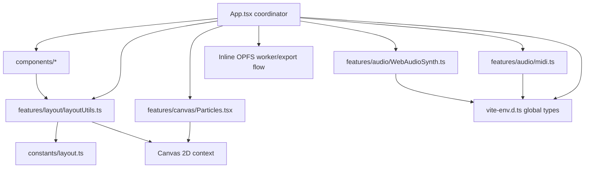
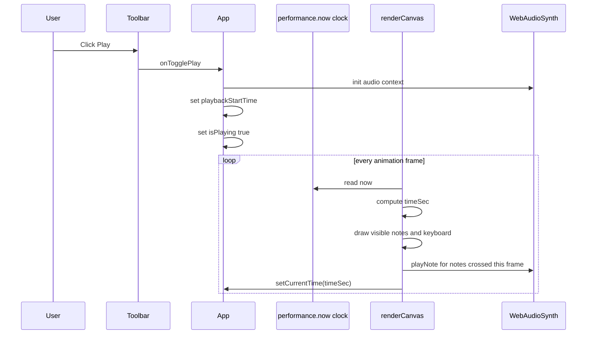
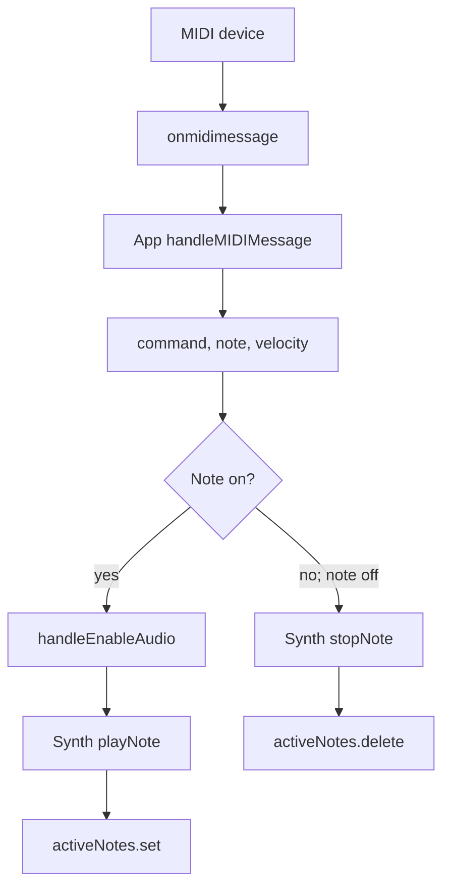

# AGENTS.md

This file is a guide for AI coding agents and maintainers working on FlowKeys. Read this before making structural changes, especially in `src/App.tsx` and the feature/component modules it coordinates.

## Project Summary

FlowKeys is a React/Vite browser app that visualizes MIDI notes on an 88-key piano using the Canvas 2D API. It supports:

- A generated demo song loaded on startup.
- User-uploaded `.mid`/`.midi` files parsed locally in `src/features/audio/midi.ts`.
- Live hardware MIDI input through the Web MIDI API.
- Lightweight synthesized audio through the Web Audio API.
- Falling note bars, active key highlights, left/right hand colors, and particle sparks.
- Experimental OPFS/Web Worker frame capture for video export.
- PWA manifest/service-worker setup through `vite-plugin-pwa`.

## Current Project Structure

```text
src/
├── App.tsx                         Main app coordinator: state, refs, MIDI wiring, render loop, export flow.
├── App.css                         App stylesheet if used by future UI work.
├── index.css                       Tailwind CSS import.
├── main.tsx                        React entry point + generated PWA service worker registration.
├── vite-env.d.ts                   Vite/PWA references plus shared global app/browser types.
├── assets/
│   └── react.svg                   Static asset from the original Vite scaffold; not part of core flow.
├── components/
│   ├── EnableAudioBanner.tsx       Audio-autoplay prompt banner.
│   ├── ErrorMessageBanner.tsx      Dismissible top error banner.
│   ├── ExportOverlay.tsx           Recording/processing/ready export modal overlay.
│   ├── HandBadge.tsx               Left/right hand color picker badge and current file name display.
│   └── Toolbar.tsx                 Header toolbar: branding, timeline, speed, particles, mute, upload, export, play/pause.
├── constants/
│   └── layout.ts                   Piano constants: A0-C8 range, keyboard height, hand split.
└── features/
    ├── audio/
    │   ├── WebAudioSynth.ts        Custom oscillator-based Web Audio synth.
    │   └── midi.ts                 Built-in MIDI parser; returns normalized note data.
    ├── canvas/
    │   └── Particles.tsx           Particle and ParticlePool classes used by the canvas renderer.
    ├── export/                     Reserved for future export extraction; export logic currently remains in App.tsx.
    └── layout/
        └── layoutUtils.ts          Canvas/layout helpers: keyboard layout, colors, time formatting, black-key test.
```

Root-level files:

```text
vite.config.ts       Vite plugins: React, Tailwind, PWA manifest/workbox config.
eslint.config.js     ESLint flat config; ignores generated dist/dev-dist output.
package.json         npm scripts and dependencies.
README.md            User-facing project docs.
AGENTS.md            This agent-facing implementation guide.
```

## Current Architecture

`src/App.tsx` is no longer a completely single-file implementation. It still owns orchestration and the performance-sensitive render loop, while reusable UI and low-level helpers have been extracted.



## Module Responsibilities

### `src/App.tsx`

`App.tsx` is the app coordinator and source of truth for runtime behavior. It imports extracted modules and owns:

- `WORKER_CODE`
  - Inline JavaScript string used to create a Web Worker at runtime.
  - Worker writes PNG frame blobs into OPFS under a `frames` directory.
  - Supports `init`, `saveFrame`, and `clear` messages.
  - If export grows, this is a good candidate to move into `src/features/export/`.

- Long-lived refs
  - `canvasRef`: the `<canvas>` element.
  - `audioSynth`: one `WebAudioSynth` instance for the app lifetime.
  - `particlePoolRef`: one `ParticlePool(900)` for object-pooled sparks.
  - `activeNotes`: live MIDI active-note map.
  - `midiData`: current demo/uploaded MIDI data.
  - `reqRef`, `lastTimeRef`, `playbackStartTime`, `pausedTime`, `lastTimeSec`: animation/playback timing.
  - `workerRef`, `exportFrameCountRef`, `pendingFramesRef`, `isExportingRef`, `isCapturingFrameRef`: export bookkeeping.

- React state
  - `isPlaying`, `isReady`, `duration`, `currentTime`, `midiDevices`, `fileName`
  - `fallSpeed`, `isMuted`, `particlesEnabled`
  - `exportState`, `exportMessage`, `exportProgress`, `errorMessage`
  - `leftColor`, `rightColor`, `audioEnabled`

- Event handlers and flows
  - Audio initialization (`handleEnableAudio`).
  - Web MIDI success/failure and message handling.
  - Demo song generation.
  - MIDI file loading via `parseMIDIArrayBuffer`.
  - Play/pause/seek/mute/particles.
  - OPFS export start, mock encoding, and download.
  - Canvas resize and animation-frame scheduling.

- `renderCanvas`
  - The performance-sensitive Canvas 2D renderer.
  - Reads playback refs/state and `midiData.current`.
  - Uses `getLayout`, `isBlackKey`, `hexToRgba`, and `getSparkColors` from `layoutUtils.ts`.
  - Draws falling notes, hit line, particles, white keys, and black keys.
  - Triggers playback audio when notes cross the playback cursor.
  - Captures PNG frames for export when `isExportingRef.current` is true.

### `src/components/EnableAudioBanner.tsx`

UI-only component for browser autoplay rules.

- Props:
  - `onEnableAudio: () => void`
- Shows a blue top banner until `audioEnabled` is true.
- Calls back into `App.tsx` so the app can initialize/resume the Web Audio context.

### `src/components/Toolbar.tsx`

Header toolbar component.

- Displays FlowKeys branding and hardware MIDI connection status.
- Contains the timeline slider and formatted current/duration times.
- Contains speed, particle, mute, upload, export, and play/pause controls.
- Imports `formatTime` from `src/features/layout/layoutUtils.ts`.
- Receives all behavior as props from `App.tsx`; keep it presentational.

Important props include:

- UI values: `currentTime`, `duration`, `exportState`, `fallSpeed`, `isMuted`, `isPlaying`, `isReady`, `midiDevices`, `particlesEnabled`
- callbacks: `onFallSpeedChange`, `onFileUpload`, `onSeek`, `onStartExport`, `onToggleMute`, `onToggleParticles`, `onTogglePlay`

### `src/components/ErrorMessageBanner.tsx`

Dismissible error banner.

- Props:
  - `message: string`
  - `onDismiss: () => void`
- Returns `null` when there is no message.
- Do not put app error state in this component; keep it controlled by `App.tsx`.

### `src/components/ExportOverlay.tsx`

Modal overlay for export state.

- Props:
  - `exportFrameCount`, `exportMessage`, `exportProgress`, `exportState`
  - `onClose`, `onDownloadVideo`
- Renders different content for `recording`, `processing`, and `ready` states.
- Returns `null` for `idle`.
- This is only UI. OPFS, worker, and mock encoding logic currently remain in `App.tsx`.

### `src/components/HandBadge.tsx`

Floating canvas badge for hand colors and current file name.

- Props:
  - `fileName`
  - `leftColor`, `rightColor`
  - `onLeftColorChange`, `onRightColorChange`
- Color values flow back to `App.tsx`; canvas rendering uses the app state values.

### `src/constants/layout.ts`

Defines piano constants in one place:

```ts
FIRST_NOTE = 21; // A0
LAST_NOTE = 108; // C8
KEYBOARD_HEIGHT = 120;
HAND_SPLIT_NOTE = 60; // Middle C
```

Exports them as `pianoConstants`.

If you alter the key range or keyboard sizing, update this file and anything that assumes 88 keys / A0-C8 / 52 white keys.

### `src/features/layout/layoutUtils.ts`

Canvas/layout helper module.

Exports:

- `hexToRgba(hex, alpha)`
  - Converts hex colors for canvas fill/glow values.
- `getSparkColors(baseHex)`
  - Builds a small color palette for sparks based on the current hand color.
- `isBlackKey(midi)`
  - Uses pitch classes `[1, 3, 6, 8, 10]`.
- `formatTime(seconds)`
  - Formats UI time as `m:ss`.
- `getLayout(width)`
  - Returns `{ positions, whiteKeyWidth, blackKeyWidth }` for MIDI notes A0-C8.
  - White keys are assigned first with `width / 52`.
  - Black keys are assigned second relative to the previous white key.

`App.tsx` depends on these helpers in the render loop. Keep them fast and allocation-conscious.

### `src/features/audio/WebAudioSynth.ts`

Custom Web Audio synth. Do not assume Tone.js is used by the current app flow.

- Lazily creates/resumes `AudioContext` in `init()`.
- `playNote(midi, velocity)` creates oscillator/gain nodes and schedules a short envelope.
- `stopNote(midi)` ramps active voice gain down and removes the voice from `activeVoices`.
- `isMuted` is mutable and controlled by the mute button in `App.tsx`.
- Uses the global `Voice` type declared in `src/vite-env.d.ts`.

Audio safety notes:

- Respect browser autoplay rules; initialize only from user gesture paths.
- Avoid unbounded active voices; make sure voices are released/deleted.
- Current behavior calls `stopNote(midi)` before retriggering the same note.

### `src/features/audio/midi.ts`

Built-in MIDI parser.

- Reads `MThd` and `MTrk` chunks.
- Handles variable-length integers, running status, note-on, note-off, tempo meta events, and common skipped MIDI event types.
- Converts ticks to seconds using tempo changes.
- Returns normalized `MidiData` with `{ notes, duration }`.
- Uses global MIDI-related types declared in `src/vite-env.d.ts`.

Parser safety notes:

- Maintain support for running status.
- Keep note-on with velocity `0` treated as note-off.
- Preserve output shape expected by `App.tsx` and the canvas renderer.
- Add focused tests or manual MIDI files when extending parser behavior.

### `src/features/canvas/Particles.tsx`

Particle system used by the render loop.

- `Particle`
  - One spark particle with `spawn`, `update`, and `draw` methods.
- `ParticlePool`
  - Preallocates particles to reduce per-frame allocations.
  - `emit(x, y, color, count)` activates inactive particles.
  - `updateAndDraw(ctx, dt)` updates active particles and draws them with additive blending.

This file currently contains no JSX despite the `.tsx` extension. If renaming to `.ts`, update imports and validate.

### `src/features/export/`

Currently present as a feature folder but not yet populated. Export behavior is still in `App.tsx`:

- Inline worker code.
- OPFS setup/clear.
- Frame capture via `canvas.toBlob` in `renderCanvas`.
- Mock FFmpeg/WASM processing.
- Download from OPFS.

If you extract export logic, `src/features/export/` is the intended destination.

### `src/vite-env.d.ts`

Contains:

- Vite and `vite-plugin-pwa` client references.
- Global app types used across modules:
  - `ExportState`
  - `MidiNote`, `MidiData`
  - `ActiveNoteInfo`
  - `KeyPosition`, `KeyboardLayout`
  - MIDI parser internals such as `RawMidiNote`, `TempoEvent`, `OpenMidiNote`
  - `Voice`
  - `WorkerMessage`
  - Web MIDI shims (`MidiMessage`, `MidiInput`, `MidiAccess`, etc.)
  - `FileSystemDirectoryWithIterators`
- Global browser interface additions:
  - `navigator.requestMIDIAccess`
  - `window.webkitAudioContext`

Be careful adding too many globals. If types become feature-specific, consider moving them into exported type modules instead.

## App Lifecycle

On mount:

1. If available, call `navigator.requestMIDIAccess()`.
2. On MIDI success, register device names and `onmidimessage` handlers.
3. Load the generated demo song into `midiData.current`.
4. Start a canvas animation loop from the resize/render effect.

On unmount:

1. Cancel the animation frame.
2. Terminate any active export worker.
3. Remove resize listener.

## Playback Flow



Important playback details:

- There is no external transport scheduler.
- Audio is triggered inside `renderCanvas` when `note.time >= prevTimeSec && note.time < timeSec`.
- Seeking updates `currentTime`, `pausedTime.current`, and `lastTimeSec.current`.
- If seeking while playing, `playbackStartTime.current` is recalculated.
- When playback reaches `duration`, `isPlaying` is set false and export processing begins if export capture was active.

## Live MIDI Flow



Notes below `HAND_SPLIT_NOTE` use `leftColor`; notes at or above it use `rightColor`.

## MIDI File Loading Flow

1. `Toolbar` emits `onFileUpload` when the hidden file input changes.
2. `App.handleFileUpload` reads the file as an `ArrayBuffer`.
3. `App.loadMidiBuffer(buffer, file.name)` calls `parseMIDIArrayBuffer` from `src/features/audio/midi.ts`.
4. Parsed data is assigned to `midiData.current`.
5. UI state is updated: filename, duration, current time, playback state, readiness.

## Canvas Rendering Flow

`renderCanvas` in `App.tsx` is the most performance-sensitive function.

Per frame it:

1. Reads the canvas and 2D context.
2. Computes `dt`, clamped to `0.1` seconds.
3. Computes `timeSec` from playback refs and state.
4. Clears the full canvas to `#08090C`.
5. Calls `getLayout(width)` for key positions.
6. Creates `activeMap` from live MIDI notes.
7. Iterates `midiData.current.notes` to:
   - calculate falling note bar positions,
   - draw visible bars,
   - trigger playback audio for newly crossed notes,
   - add currently sounding notes to `activeMap`,
   - emit particles at the hit line.
8. Draws the red hit line.
9. Updates/draws the particle pool if enabled.
10. Draws white keys, highlighting active notes.
11. Draws black keys, highlighting active notes.
12. Captures a PNG frame if `isExportingRef.current` is true.

The effect around `renderCanvas` owns `requestAnimationFrame` scheduling. Avoid making `renderCanvas` schedule itself unless you also revisit hook dependencies carefully.

### Coordinate Model

- `x` maps MIDI keys to keyboard positions.
- `hitLineY = canvas.height - KEYBOARD_HEIGHT`.
- A note’s bottom edge is:

```ts
const timeUntilHit = note.time - timeSec;
const yBottom = hitLineY - timeUntilHit * fallSpeed;
```

- A note’s height is:

```ts
const noteHeight = note.duration * fallSpeed;
const yTop = yBottom - noteHeight;
```

A note is drawn if it intersects the visible area above the keyboard:

```ts
if (yBottom > 0 && yTop < hitLineY) {
  // draw
}
```

## Export Flow

The export flow is a prototype, not a complete production encoder.

1. `startExport()` checks OPFS support.
2. It creates a Web Worker from the `WORKER_CODE` string in `App.tsx`.
3. It initializes and clears an OPFS `frames` directory.
4. It resets playback to `0` and starts playing.
5. During render, `canvas.toBlob` creates PNG frames and posts them to the worker.
6. The worker writes frames as `frame_00000.png`, `frame_00001.png`, etc.
7. When playback ends, `mockExportViaFFMPEGWASM()` runs.
8. Current behavior simulates FFmpeg/WASM work and writes a mock/fetched MP4 blob to OPFS as `export.mp4`.
9. `downloadVideo()` downloads `export.mp4` and attempts to remove `frames`.
10. `ExportOverlay` displays export UI based on `exportState`.

When working on export:

- Preserve worker cleanup on unmount.
- Avoid blocking the main thread while writing many frames.
- Be explicit in UI/docs if export is mocked vs real.
- Check browser compatibility; OPFS is not universal.
- Prefer moving non-UI export utilities into `src/features/export/` if the flow grows.

## Vite/PWA Notes

`vite.config.ts` uses:

- `react()`
- `tailwindcss()`
- `VitePWA({ registerType: "autoUpdate", ... })`

The manifest is configured for:

- App name: `FlowKeys - Real-time MIDI Visualizer`
- Short name: `FlowKeys`
- Standalone display
- Landscape-primary orientation
- Theme/background colors
- SVG favicon as maskable icon
- Music/entertainment/education categories

`src/main.tsx` imports `registerSW` from `virtual:pwa-register` and prompts the user to reload when new content is available.

If you change PWA behavior, check both `vite.config.ts` and `src/main.tsx`.

## Coding Guidance for Agents

### General

- Keep changes minimal and aligned with the current modular structure.
- Keep `App.tsx` focused on orchestration, refs/state, browser API flows, and canvas rendering.
- Put presentational UI in `src/components/`.
- Put reusable feature logic in `src/features/<domain>/`.
- Put cross-cutting constants in `src/constants/`.
- Do not assume Tone.js powers playback; it currently does not.
- Do not claim real MP4 encoding unless `mockExportViaFFMPEGWASM` has been replaced by a real encoder.

### State vs refs

Use React state for values rendered by JSX. Use refs for:

- per-frame mutable timing values,
- large MIDI data,
- active note maps,
- animation frame IDs,
- worker/export bookkeeping,
- object pools.

Avoid putting per-frame data into state unless the UI must display it.

### Component boundaries

- Components in `src/components/` should be controlled/presentational when possible.
- Keep file reading, audio initialization, MIDI access, export, and render-loop mutations in `App.tsx` or feature modules, not in UI components.
- If a component needs a new action, pass a callback from `App.tsx` rather than importing app state directly.
- Keep prop types close to components unless they need to be shared broadly.

### Render loop safety

Be cautious when modifying `renderCanvas`:

- Avoid expensive allocations inside loops.
- Avoid async work except the existing guarded `canvas.toBlob` export path.
- Keep note culling checks before drawing.
- Keep black key rendering after white key rendering so black keys appear on top.
- Keep audio trigger logic based on `prevTimeSec`/`timeSec` to avoid replaying notes every frame.
- Keep helper functions used inside the render loop fast and deterministic.

### MIDI parser safety

If changing `parseMIDIArrayBuffer`:

- Maintain support for running status.
- Preserve tempo conversion semantics.
- Keep note-on with velocity `0` treated as note-off.
- Keep output shape compatible with rendering and playback.
- Add or manually test MIDI files with multiple tracks and tempo changes when possible.

### Audio safety

If changing `WebAudioSynth`:

- Respect browser autoplay rules; initialize audio only from a user gesture path.
- Keep `isMuted` behavior consistent with the mute button.
- Avoid unbounded active voices; ensure voices are removed/released.
- Be mindful of overlapping repeated notes; current behavior calls `stopNote(midi)` before retriggering the same note.

### Browser API compatibility

Feature-check APIs before using them:

- `navigator.requestMIDIAccess`
- `window.AudioContext || window.webkitAudioContext`
- `navigator.storage && navigator.storage.getDirectory`
- `canvas.toBlob`
- `ctx.roundRect`

## Validation Checklist

For documentation-only changes:

```bash
npm run lint
```

For code changes:

```bash
npm run lint
npm run build
```

Manual checks worth doing in a browser:

1. App loads and demo song appears.
2. Enable Audio works after a click.
3. Play/pause/seek works.
4. Uploading a MIDI file updates filename/duration and plays notes.
5. Speed slider changes falling note speed.
6. Left/right color pickers affect falling notes, particles, and active keys.
7. Particle toggle works.
8. Mute toggle prevents new notes from sounding.
9. Hardware MIDI input is detected where supported.
10. Export flow handles unsupported OPFS gracefully.

## Known Implementation Caveats

- `App.tsx` still owns the render loop and export flow, so it remains a high-risk file despite UI/helper extraction.
- The MIDI parser is focused on note visualization/playback, not exhaustive MIDI compatibility.
- Video export currently simulates encoding.
- Web MIDI and OPFS support varies by browser.
- Global app types currently live in `src/vite-env.d.ts`; consider extracting shared types into dedicated modules if they grow.
- `tone` and `@tonejs/midi` are installed but not used by the current app flow.
