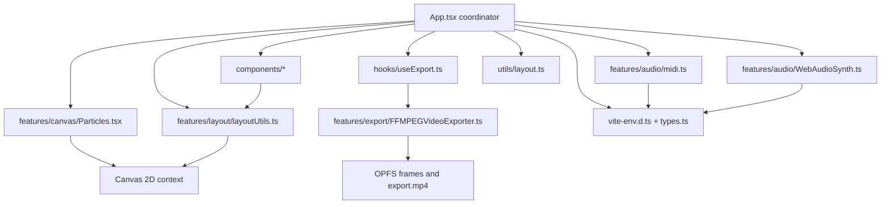
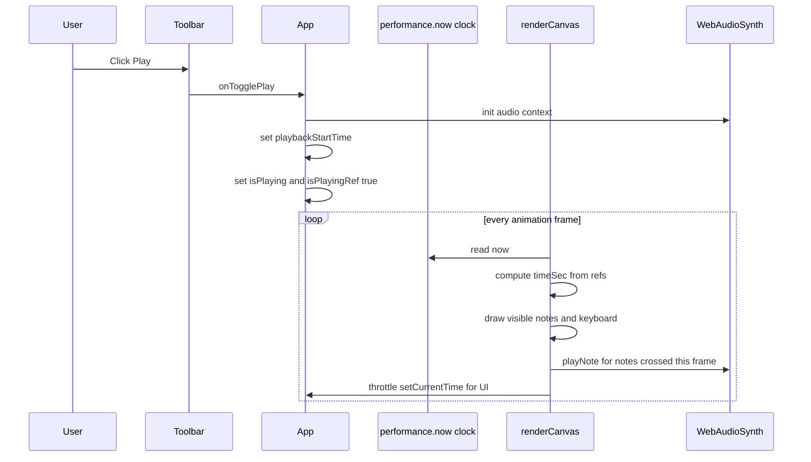
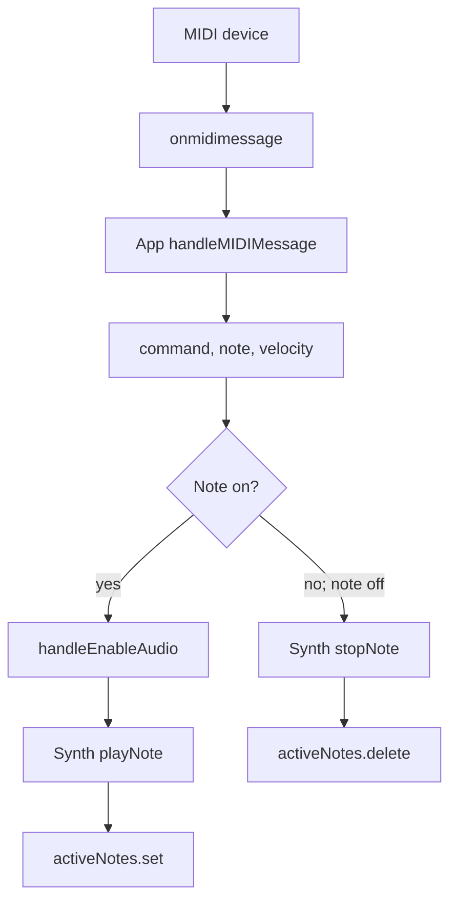

# AGENTS.md

This file is a guide for AI coding agents and maintainers working on FlowKeys.
Read this before making structural changes, especially in `src/App.tsx`, the
canvas render loop, MIDI/audio flows, and the OPFS/FFmpeg export path.

## Project Summary

FlowKeys is a React/Vite browser app that visualizes MIDI notes on an 88-key
piano using the Canvas 2D API. It supports:

- A generated demo song loaded on startup.
- User-uploaded `.mid`/`.midi` files parsed locally in `src/features/audio/midi.ts`.
- Live hardware MIDI input through the Web MIDI API.
- Lightweight synthesized audio through the Web Audio API.
- Falling note bars, active key highlights, left/right hand colors, and particle sparks.
- OPFS/Web Worker frame capture and FFmpeg WASM MP4 export.
- PWA manifest/service-worker setup through `vite-plugin-pwa`.

## Current Project Structure

```text
src/
├── App.tsx                         Main app coordinator: state, refs, MIDI wiring, render loop, export capture.
├── App.css                         App stylesheet if used by future UI work.
├── index.css                       Tailwind CSS import.
├── main.tsx                        React entry point + generated PWA service worker registration.
├── types.ts                        Export-related shared TypeScript interfaces.
├── vite-env.d.ts                   Vite/PWA references plus shared global app/browser types.
├── assets/
│   └── react.svg                   Static asset from the original Vite scaffold; not core flow.
├── components/
│   ├── EnableAudioBanner.tsx       Audio-autoplay prompt banner.
│   ├── ErrorMessageBanner.tsx      Dismissible top error banner.
│   ├── ExportOverlay.tsx           Recording/processing/ready export modal overlay.
│   ├── HandBadge.tsx               Left/right hand color picker badge and current file name display.
│   └── Toolbar.tsx                 Header toolbar: branding, timeline, speed, particles, mute, upload, export, play/pause.
├── features/
│   ├── audio/
│   │   ├── WebAudioSynth.ts        Custom oscillator-based Web Audio synth.
│   │   └── midi.ts                 Built-in MIDI parser; returns sorted normalized note data.
│   ├── canvas/
│   │   └── Particles.tsx           Particle and ParticlePool classes used by the canvas renderer.
│   ├── export/
│   │   └── FFMPEGVideoExporter.ts  FFmpeg WASM loader/encoder and export configuration.
│   └── layout/
│       └── layoutUtils.ts          Canvas/layout helpers: keyboard layout, colors, time formatting, black-key test.
├── hooks/
│   ├── useExport.ts                Export UI state, FFmpeg orchestration, OPFS download helper.
│   └── useMidi.ts                  Reserved for future MIDI hook extraction; currently empty.
└── utils/
    ├── error.ts                    Error-to-string helper.
    └── layout.ts                   Piano constants: A0-C8 range, keyboard height, hand split.
```

Root-level files:

```text
vite.config.ts       Vite plugins, PWA manifest/workbox config, FFmpeg WASM dev headers.
eslint.config.js     ESLint flat config; ignores generated build output.
package.json         npm scripts and dependencies.
README.md            User-facing project docs.
AGENTS.md            This agent-facing implementation guide.
```

## Current Architecture

`src/App.tsx` is the app coordinator and source of truth for runtime behavior. It
owns browser API wiring and the performance-sensitive render loop, while reusable
UI and feature logic are extracted.



## Module Responsibilities

### `src/App.tsx`

`App.tsx` imports extracted modules and owns:

- `WORKER_CODE`
  - Inline JavaScript string used to create a Web Worker at runtime.
  - Worker writes PNG frame blobs into OPFS under `frames`.
  - Supports `init`, `saveFrame`, and `clear` messages.

- Long-lived refs
  - `canvasRef`: the `<canvas>` element.
  - `audioSynth`: one `WebAudioSynth` instance for the app lifetime.
  - `particlePoolRef`: one `ParticlePool(900)` for object-pooled sparks.
  - `activeNotes`: live MIDI active-note map.
  - `midiData`: current demo/uploaded MIDI data.
  - `reqRef`, `lastTimeRef`, `playbackStartTime`, `pausedTime`, `lastTimeSec`:
    animation/playback timing.
  - `currentTimeRef`, `lastUIUpdateRef`: render-loop playback time and throttled
    UI updates.
  - `isPlayingRef`, `fallSpeedRef`, `leftColorRef`, `rightColorRef`,
    `particlesEnabledRef`, `durationRef`: render-loop-safe mirrors of state.
  - `leftColorRgbaRef`, `rightColorRgbaRef`, `leftSparkColorsRef`,
    `rightSparkColorsRef`: precomputed render-loop color values.
  - `workerRef`, `exportFrameCountRef`, `pendingFramesRef`, `isExportingRef`,
    `isCapturingFrameRef`, `lastExportCaptureTimeRef`, `frameSavedHandlerRef`:
    export capture/bookkeeping.
  - `exportViaFFMPEGWASMRef`: latest export function from `useExport` without
    recreating `renderCanvas`.

- React state
  - `isPlaying`, `isReady`, `duration`, `currentTime`, `midiDevices`, `fileName`
  - `fallSpeed`, `isMuted`, `particlesEnabled`
  - `leftColor`, `rightColor`, `audioEnabled`
  - Export UI state comes from `useExport`: `exportState`, `exportMessage`,
    `exportProgress`, `errorMessage`.

- Event handlers and flows
  - Audio initialization (`handleEnableAudio`).
  - Web MIDI success/failure and message handling.
  - Demo song generation.
  - MIDI file loading via `parseMIDIArrayBuffer`.
  - Play/pause/seek/mute/particles.
  - OPFS export capture setup and worker lifecycle.
  - Canvas resize and animation-frame scheduling.

- `renderCanvas`
  - The performance-sensitive Canvas 2D renderer.
  - Intentionally has a stable empty dependency array.
  - Reads current render values from refs instead of React state.
  - Throttles `setCurrentTime` UI updates to avoid 60fps React re-renders.
  - Uses note culling/early termination against sorted MIDI notes.
  - Draws falling notes, hit line, particles, white keys, and black keys.
  - Triggers playback audio when notes cross the playback cursor.
  - Captures PNG frames for export at `exportConfig.frameIntervalMs` when
    `isExportingRef.current` is true.

### `src/components/EnableAudioBanner.tsx`

UI-only component for browser autoplay rules.

- Props:
  - `onEnableAudio: () => void`
- Shows a top banner until `audioEnabled` is true.
- Calls back into `App.tsx` so the app can initialize/resume Web Audio.

### `src/components/Toolbar.tsx`

Header toolbar component.

- Displays FlowKeys branding and hardware MIDI connection status.
- Contains the timeline slider and formatted current/duration times.
- Contains speed, particle, mute, upload, export, and play/pause controls.
- Imports `formatTime` from `src/features/layout/layoutUtils.ts`.
- Receives behavior as props from `App.tsx`; keep it presentational.

Important props include:

- UI values: `currentTime`, `duration`, `exportState`, `fallSpeed`, `isMuted`,
  `isPlaying`, `isReady`, `midiDevices`, `particlesEnabled`
- callbacks: `onFallSpeedChange`, `onFileUpload`, `onSeek`, `onStartExport`,
  `onToggleMute`, `onToggleParticles`, `onTogglePlay`

### `src/components/ErrorMessageBanner.tsx`

Dismissible error banner.

- Props:
  - `message: string`
  - `onDismiss: () => void`
- Returns `null` when there is no message.
- Keep app error state controlled by `App.tsx` / `useExport`.

### `src/components/ExportOverlay.tsx`

Modal overlay for export state.

- Props:
  - `exportFrameCount`, `exportMessage`, `exportProgress`, `exportState`
  - `onClose`, `onDownloadVideo`
- Renders different content for `recording`, `processing`, and `ready` states.
- Returns `null` for `idle`.
- UI only; OPFS worker setup lives in `App.tsx`, FFmpeg orchestration lives in
  `useExport`, and FFmpeg encoding lives in `FFMPEGVideoExporter`.

### `src/components/HandBadge.tsx`

Floating canvas badge for hand colors and current file name.

- Props:
  - `fileName`
  - `leftColor`, `rightColor`
  - `onLeftColorChange`, `onRightColorChange`
- Color values flow back to `App.tsx`; canvas rendering uses ref mirrors of the
  app state values.

### `src/utils/layout.ts`

Defines piano constants in one place:

```ts
FIRST_NOTE = 21; // A0
LAST_NOTE = 108; // C8
KEYBOARD_HEIGHT = 120;
HAND_SPLIT_NOTE = 60; // Middle C
```

Exports them as `pianoConstants`.

If you alter the key range or keyboard sizing, update this file and anything
that assumes 88 keys / A0-C8 / 52 white keys.

### `src/features/layout/layoutUtils.ts`

Canvas/layout helper module.

Exports:

- `hexToRgba(hex, alpha)`
  - Converts hex colors for canvas fill values.
- `getSparkColors(baseHex)`
  - Builds a small color palette for sparks based on the current hand color.
- `isBlackKey(midi)`
  - Uses pitch classes `[1, 3, 6, 8, 10]`.
- `formatTime(seconds)`
  - Formats UI time as `m:ss`.
- `getLayout(width)`
  - Returns `{ positions, whiteKeyWidth, blackKeyWidth }` for MIDI notes A0-C8.
  - White keys are assigned first with `width / 52`.
  - Black keys are assigned second relative to the previous white key.

`App.tsx` depends on these helpers in the render loop. Keep them fast and
allocation-conscious.

### `src/features/audio/WebAudioSynth.ts`

Custom Web Audio synth. Do not assume Tone.js is used by the current app flow.

- Lazily creates/resumes `AudioContext` in `init()`.
- `playNote(midi, velocity)` creates oscillator/gain nodes and schedules a short
  envelope.
- `stopNote(midi)` ramps active voice gain down and removes the voice from
  `activeVoices`.
- `isMuted` is mutable and controlled by the mute button in `App.tsx`.
- Uses the global `Voice` type declared in `src/vite-env.d.ts`.

Audio safety notes:

- Respect browser autoplay rules; initialize only from user gesture paths.
- Avoid unbounded active voices; make sure voices are released/deleted.
- Current behavior calls `stopNote(midi)` before retriggering the same note.

### `src/features/audio/midi.ts`

Built-in MIDI parser.

- Reads `MThd` and `MTrk` chunks.
- Handles variable-length integers, running status, note-on, note-off, tempo
  meta events, and common skipped MIDI event types.
- Converts ticks to seconds using tempo changes.
- Returns normalized `MidiData` with `{ notes, duration }`.
- Sorts parsed notes by `time`; this is important for render-loop note culling.
- Uses global MIDI-related types declared in `src/vite-env.d.ts`.

Parser safety notes:

- Maintain support for running status.
- Keep note-on with velocity `0` treated as note-off.
- Preserve tempo conversion semantics.
- Keep parsed notes sorted by `time`.
- Preserve output shape expected by `App.tsx` and the canvas renderer.
- Add focused tests or manual MIDI files with multiple tracks and tempo changes
  when extending parser behavior.

### `src/features/canvas/Particles.tsx`

Particle system used by the render loop.

- `Particle`
  - One spark particle with `spawn`, `update`, and `draw` methods.
  - Velocity is pixels per second and motion is frame-rate independent via `dt`.
  - Avoids per-particle `shadowBlur` and `save()`/`restore()` for performance.
- `ParticlePool`
  - Preallocates particles to reduce per-frame allocations.
  - `emit(x, y, color, count)` activates inactive particles.
  - `updateAndDraw(ctx, dt)` updates active particles and draws them with one
    additive-blending canvas state wrapper.

This file currently contains no JSX despite the `.tsx` extension. If renaming to
`.ts`, update imports and validate.

### `src/features/export/FFMPEGVideoExporter.ts`

FFmpeg WASM encoder and export configuration.

- Exports `exportConfig`:
  - `fps`: nominal capture/encoding FPS.
  - `frameIntervalMs`: desired frame-capture interval.
  - `defaultFilename`: `export.mp4`.
  - `directory`: OPFS frame directory (`frames`).
  - `frameExtension`: `png`.
- `FfmpegVideoExporter` is a singleton wrapper around `@ffmpeg/ffmpeg`.
- `load(onLog, onProgress)` downloads/loads FFmpeg core from jsDelivr ESM paths.
- `exportVideo(fileUri, { durationSeconds })`:
  - Reads OPFS PNG frames.
  - Writes them into FFmpeg’s virtual filesystem.
  - Computes input `-framerate` from `frameNames.length / durationSeconds` when
    duration is available. This keeps exported video duration aligned with the
    source even when `canvas.toBlob` drops below nominal capture FPS.
  - Uses H.264/libx264 and `+faststart`.
  - Uses `scale=trunc(iw/2)*2:trunc(ih/2)*2,format=yuv420p` because H.264/yuv420p
    requires even dimensions and canvas sizes can be odd.
  - Checks FFmpeg exit code and guards against empty output.
  - Cleans up FFmpeg virtual files after encoding.

### `src/hooks/useExport.ts`

Export state and orchestration hook.

- Owns `exportState`, `exportMessage`, `exportProgress`, and `errorMessage`.
- `exportViaFFMPEGWASM(durationSeconds?)`:
  - Loads/reuses the singleton `FfmpegVideoExporter`.
  - Pipes FFmpeg progress into overlay progress.
  - Suppresses FFmpeg WASM’s benign `Aborted()` process-exit log after successful
    encodes.
  - Counts OPFS frames for UI feedback.
  - Calls `exporter.exportVideo(exportConfig.directory, { durationSeconds })`.
  - Saves the resulting MP4 Blob to OPFS as `export.mp4`.
- `downloadVideoFromOPFS(fileName?)`:
  - Reads `export.mp4` from OPFS.
  - Triggers browser download.
  - Delays `URL.revokeObjectURL` to avoid download race issues.
  - Removes the `frames` directory after download.

### `src/types.ts`

Shared export type interfaces:

- `VideoExportOptions`
  - `durationSeconds?: number`
- `VideoExporter`
  - `exportVideo(fileUri, options?) => Promise<Blob>`

### `src/vite-env.d.ts`

Contains:

- Vite and `vite-plugin-pwa` client references.
- Global app types used across modules:
  - `ExportState`
  - `MidiNote`, `MidiData`
  - `ActiveNoteInfo`
  - `KeyPosition`, `KeyboardLayout`
  - MIDI parser internals such as `RawMidiNote`, `TempoEvent`, `OpenMidiNote`
  - `Voice`
  - `WorkerMessage`
  - Web MIDI shims (`MidiMessage`, `MidiInput`, `MidiAccess`, etc.)
  - `FileSystemDirectoryWithIterators`
- Global browser interface additions:
  - `navigator.requestMIDIAccess`
  - `window.webkitAudioContext`

Be careful adding too many globals. If types become feature-specific, prefer
exported type modules such as `src/types.ts`.

## App Lifecycle

On mount:

1. If available, call `navigator.requestMIDIAccess()`.
2. On MIDI success, register device names and `onmidimessage` handlers.
3. Load the generated demo song into `midiData.current`.
4. Start a canvas animation loop from the resize/render effect.

On unmount:

1. Cancel the animation frame.
2. Remove export worker message listeners.
3. Terminate any active export worker.
4. Remove resize listener.

## Playback Flow



Important playback details:

- There is no external transport scheduler.
- Audio is triggered inside `renderCanvas` when
  `note.time >= prevTimeSec && note.time < timeSec`.
- `currentTimeRef.current` is the render-loop source of truth for the current
  playback time; `currentTime` state is for UI.
- Seeking updates `currentTime`, `currentTimeRef.current`, `pausedTime.current`,
  and `lastTimeSec.current`.
- If seeking while playing, `playbackStartTime.current` is recalculated.
- When playback reaches `duration`, `isPlaying`/`isPlayingRef` are set false and
  export processing begins if export capture was active.

## Live MIDI Flow



Notes below `HAND_SPLIT_NOTE` use `leftColor`; notes at or above it use
`rightColor`.

## MIDI File Loading Flow

1. `Toolbar` emits `onFileUpload` when the hidden file input changes.
2. `App.handleFileUpload` reads the file as an `ArrayBuffer`.
3. `App.loadMidiBuffer(buffer, file.name)` calls `parseMIDIArrayBuffer` from
   `src/features/audio/midi.ts`.
4. Parsed data is assigned to `midiData.current`.
5. UI/ref state is reset: filename, duration, current time, playback state,
   readiness.

## Canvas Rendering Flow

`renderCanvas` in `App.tsx` is the most performance-sensitive function.

Per frame it:

1. Reads the canvas and 2D context.
2. Computes `dt`, clamped to `0.1` seconds.
3. Computes `timeSec` from playback refs.
4. Updates `currentTime` state only when the UI throttle interval elapses.
5. Clears the full canvas to `#08090C`.
6. Calls `getLayout(width)` for key positions.
7. Uses sorted MIDI notes to skip notes that have already fallen off screen and
   break once future notes are beyond the visible window.
8. Draws visible falling note bars.
9. Triggers playback audio for newly crossed notes.
10. Builds active-note info from live MIDI and current playback notes.
11. Emits particles at the hit line when enabled.
12. Draws the red hit line.
13. Updates/draws the particle pool if enabled.
14. Draws white keys, then black keys, highlighting active notes.
15. Captures a PNG frame if export is active and the export frame interval has elapsed.

The effect around `renderCanvas` owns `requestAnimationFrame` scheduling. Avoid
making `renderCanvas` schedule itself. Avoid adding state dependencies to
`renderCanvas`; use refs for values read in the hot path.

### Coordinate Model

- `x` maps MIDI keys to keyboard positions.
- `hitLineY = canvas.height - KEYBOARD_HEIGHT`.
- A note’s bottom edge is:

```ts
const timeUntilHit = note.time - timeSec;
const yBottom = hitLineY - timeUntilHit * fallSpeed;
```

- A note’s height is:

```ts
const noteHeight = note.duration * fallSpeed;
const yTop = yBottom - noteHeight;
```

A note is drawn if it intersects the visible area above the keyboard:

```ts
if (yBottom > 0 && yTop < hitLineY) {
  // draw
}
```

## Export Flow

The export flow performs real FFmpeg WASM MP4 encoding, but it is still
experimental because it is browser-resource-heavy and depends on OPFS/WASM
support.

1. `startExport()` checks OPFS support.
2. It creates a Web Worker from the `WORKER_CODE` string in `App.tsx`.
3. It initializes and clears an OPFS `frames` directory.
4. It resets playback to `0` and starts playing.
5. During render, `canvas.toBlob` creates PNG frames at the configured export
   interval and posts them to the worker.
6. The worker writes frames as `frame_00000.png`, `frame_00001.png`, etc.
7. When playback ends, `App.tsx` waits for pending `toBlob`/worker writes to
   finish before encoding.
8. `useExport.exportViaFFMPEGWASM(durationSeconds)` loads/reuses FFmpeg WASM and
   calls `FfmpegVideoExporter.exportVideo`.
9. FFmpeg reads PNG frames from its virtual FS and writes `output.mp4`.
10. The MP4 blob is saved to OPFS as `export.mp4`.
11. `downloadVideoFromOPFS()` downloads `export.mp4` and attempts to remove
    `frames`.
12. `ExportOverlay` displays export UI based on `exportState`.

Export timing details:

- `exportConfig.fps` is the nominal capture FPS.
- `canvas.toBlob` and OPFS writes can miss frames under load.
- To avoid exported video speed drift, FFmpeg’s input `-framerate` is computed
  from `capturedFrameCount / durationSeconds` when duration is available.
- H.264/yuv420p requires even dimensions, so the FFmpeg filter chain crops/scales
  odd canvas dimensions to even values.

When working on export:

- Preserve worker cleanup on unmount.
- Avoid blocking the render loop while writing frames.
- Wait for pending frame writes before starting FFmpeg.
- Keep output validation: check FFmpeg exit code and non-empty output.
- Check browser compatibility; OPFS and FFmpeg WASM are not universal.
- Be explicit in docs/UI that export is real FFmpeg WASM encoding but still
  experimental/browser-dependent.

## Vite/PWA Notes

`vite.config.ts` uses:

- `react()`
- `tailwindcss()`
- `VitePWA({ registerType: "autoUpdate", ... })`

The Vite/PWA config includes:

- PWA manifest for `FlowKeys - Real-time MIDI Visualizer`.
- Workbox precaching for build/static assets.
- Runtime caching for Google Fonts CSS.
- Runtime caching for `@ffmpeg/core` ESM files from jsDelivr.
- `navigateFallback: null`.
- `devOptions.enabled: true` for PWA behavior in dev.
- Dev server COOP/COEP headers:
  - `Cross-Origin-Opener-Policy: same-origin`
  - `Cross-Origin-Embedder-Policy: require-corp`
- `optimizeDeps.exclude` for `@ffmpeg/ffmpeg` and `@ffmpeg/util` to avoid
  breaking FFmpeg worker behavior.

`src/main.tsx` imports `registerSW` from `virtual:pwa-register` and prompts the
user to reload when new content is available.

If you change PWA or FFmpeg WASM behavior, check both `vite.config.ts` and
`src/main.tsx`.

## Coding Guidance for Agents

### General

- Keep changes minimal and aligned with the current modular structure.
- Keep `App.tsx` focused on orchestration, refs/state, browser API flows, render
  loop, and export frame capture.
- Put presentational UI in `src/components/`.
- Put reusable feature logic in `src/features/<domain>/`.
- Put cross-cutting hooks in `src/hooks/`.
- Put small shared utilities in `src/utils/`.
- Do not assume Tone.js powers playback; it currently does not.
- Do not describe export as mocked; it currently uses FFmpeg WASM. Do still call
  it experimental/browser-dependent.

### State vs refs

Use React state for values rendered by JSX. Use refs for:

- per-frame mutable timing values,
- render-loop mirrors of UI state,
- large MIDI data,
- active note maps,
- animation frame IDs,
- worker/export bookkeeping,
- object pools,
- latest callback references needed by stable render callbacks.

Avoid putting per-frame data into state unless the UI must display it, and
throttle UI updates when possible.

### Component boundaries

- Components in `src/components/` should remain controlled/presentational.
- Keep file reading, audio initialization, MIDI access, export capture, and
  render-loop mutations in `App.tsx` or feature/hooks modules, not UI components.
- If a component needs a new action, pass a callback from `App.tsx` rather than
  importing app state directly.
- Keep prop types close to components unless they need to be shared broadly.

### Render loop safety

Be cautious when modifying `renderCanvas`:

- Avoid expensive allocations inside loops.
- Avoid `shadowBlur` in hot per-note/per-particle paths.
- Avoid per-element `ctx.save()`/`ctx.restore()` unless necessary.
- Avoid async work except the guarded `canvas.toBlob` export path.
- Keep note culling checks before drawing.
- Keep MIDI notes sorted by time.
- Keep black key rendering after white key rendering so black keys appear on top.
- Keep audio trigger logic based on `prevTimeSec`/`timeSec` to avoid replaying
  notes every frame.
- Keep helper functions used inside the render loop fast and deterministic.
- Keep `renderCanvas` stable; prefer refs over dependencies.

### MIDI parser safety

If changing `parseMIDIArrayBuffer`:

- Maintain support for running status.
- Preserve tempo conversion semantics.
- Keep note-on with velocity `0` treated as note-off.
- Keep output shape compatible with rendering and playback.
- Keep parsed notes sorted by `time`.
- Add or manually test MIDI files with multiple tracks and tempo changes when
  possible.

### Audio safety

If changing `WebAudioSynth`:

- Respect browser autoplay rules; initialize audio only from a user gesture path.
- Keep `isMuted` behavior consistent with the mute button.
- Avoid unbounded active voices; ensure voices are removed/released.
- Be mindful of overlapping repeated notes; current behavior calls
  `stopNote(midi)` before retriggering the same note.

### Export safety

If changing FFmpeg/export behavior:

- Preserve OPFS feature checks.
- Preserve worker listener cleanup and termination.
- Preserve pending-frame-write waiting before encoding.
- Keep frame naming compatible with FFmpeg input pattern (`frame_%05d.png`).
- Keep duration-aware input framerate unless you also implement deterministic
  timeline-based frame rendering.
- Keep even-dimension/yuv420p handling for H.264 compatibility.
- Avoid revoking Blob URLs synchronously before downloads start.
- Remember FFmpeg core is large; avoid unnecessary reloads and duplicate loads.

### Browser API compatibility

Feature-check APIs before using them:

- `navigator.requestMIDIAccess`
- `window.AudioContext || window.webkitAudioContext`
- `navigator.storage && navigator.storage.getDirectory`
- `canvas.toBlob`
- `ctx.roundRect`

## Validation Checklist

For documentation-only changes:

```bash
npm run lint
```

For code changes:

```bash
npm run lint
npm run build
```

Manual checks worth doing in a browser:

1. App loads and demo song appears.
2. Enable Audio works after a click.
3. Play/pause/seek works.
4. Uploading a MIDI file updates filename/duration and plays notes.
5. Speed slider changes falling note speed.
6. Left/right color pickers affect falling notes, particles, and active keys.
7. Particle toggle works.
8. Mute toggle prevents new notes from sounding.
9. Hardware MIDI input is detected where supported.
10. Export flow handles unsupported OPFS gracefully.
11. Export captures frames, runs FFmpeg, produces a non-empty MP4, and downloads.
12. Exported MP4 duration roughly matches the source duration.

## Known Implementation Caveats

- `App.tsx` still owns the render loop and export frame capture, so it remains a
  high-risk file despite UI/helper extraction.
- The MIDI parser is focused on note visualization/playback, not exhaustive MIDI
  compatibility.
- FFmpeg WASM export is real MP4 encoding but remains experimental and can be
  slow or memory-heavy for long songs/large canvases.
- Web MIDI, OPFS, service workers, and FFmpeg WASM support vary by browser.
- Some app/browser shim types currently live in `src/vite-env.d.ts`; feature
  interfaces can live in dedicated modules like `src/types.ts`.
