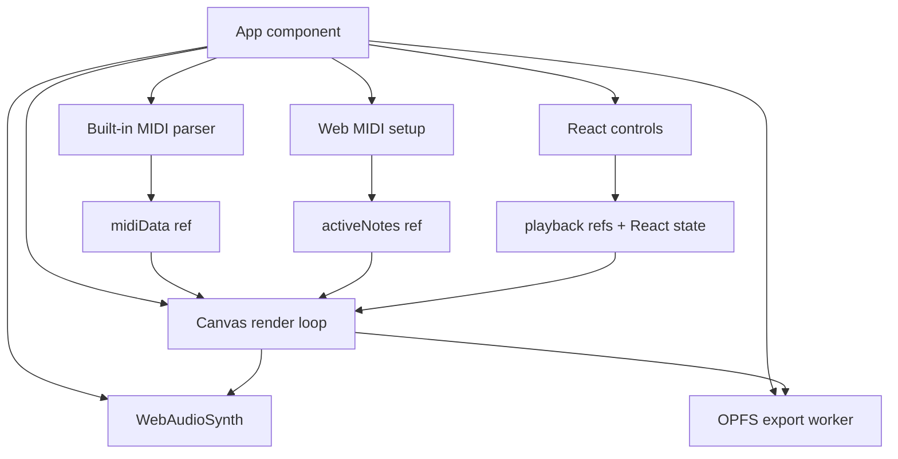
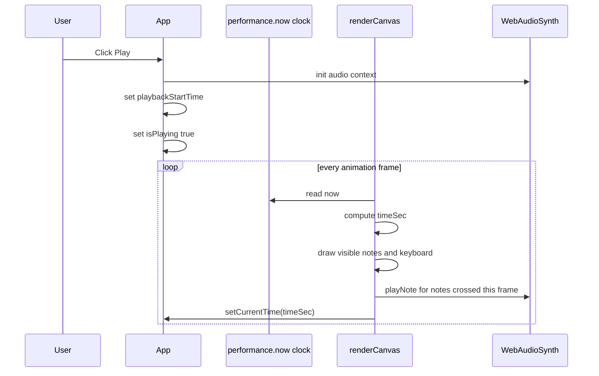
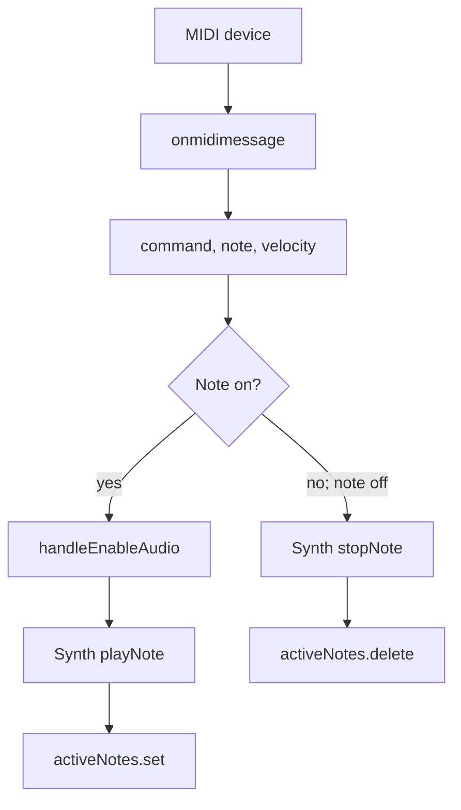

# AGENTS.md

This file is a guide for AI coding agents and maintainers working on FlowKeys. Read this before making structural changes, especially in `src/App.tsx`.

## Project Summary

FlowKeys is a React/Vite browser app that visualizes MIDI notes on an 88-key piano using the Canvas 2D API. It supports:

- A generated demo song loaded on startup.
- User-uploaded `.mid`/`.midi` files parsed locally in `src/App.tsx`.
- Live hardware MIDI input through the Web MIDI API.
- Lightweight synthesized audio through the Web Audio API.
- Falling note bars, active key highlights, left/right hand colors, and particle sparks.
- Experimental OPFS/Web Worker frame capture for video export.
- PWA manifest/service-worker setup through `vite-plugin-pwa`.

## Important Files

```text
src/App.tsx       Main app. Contains classes, MIDI parser, synth, render loop, UI, export flow.
src/main.tsx      React entry point. Registers the generated PWA service worker.
src/index.css     Tailwind CSS import only.
vite.config.ts    Vite plugins: React, Tailwind, PWA manifest/workbox config.
package.json      npm scripts and dependencies.
README.md         User-facing project docs.
AGENTS.md         This agent-facing implementation guide.
```

## Current Architecture

The app is intentionally compact but `src/App.tsx` is doing many jobs. Treat it as the source of truth for current behavior.



## `src/App.tsx` Map

### Top-level utility/classes

- `WORKER_CODE`
  - Inline JavaScript string used to create a Web Worker at runtime.
  - Worker writes PNG frame blobs into OPFS under a `frames` directory.
  - Supports `init`, `saveFrame`, and `clear` messages.

- `Particle`
  - Represents one spark particle.
  - Has `spawn`, `update`, and `draw` methods.
  - Uses simple velocity, gravity, alpha fade, and lifetime values.

- `ParticlePool`
  - Preallocates a pool of `Particle` objects to reduce per-frame allocations.
  - `emit(x, y, color, count)` activates inactive particles.
  - `updateAndDraw(ctx, dt)` updates active particles and draws them with additive blending.

- `WebAudioSynth`
  - Custom Web Audio synth. Do not assume Tone.js is used by the current app flow.
  - Lazily creates/resumes `AudioContext` in `init()`.
  - `playNote(midi, velocity)` creates oscillator/gain nodes and schedules a short envelope.
  - `stopNote(midi)` ramps active voice gain down and removes the voice from `activeVoices`.
  - `isMuted` is a mutable property toggled from React UI.

- `parseMIDIArrayBuffer(buffer)`
  - Built-in MIDI parser.
  - Reads `MThd` and `MTrk` chunks.
  - Handles variable-length integers, running status, note-on, note-off, tempo meta events, and common skipped MIDI event types.
  - Produces normalized `{ notes, duration }` data.
  - The parser is not a complete MIDI implementation. If you extend it, add focused tests or test files manually.

- Constants/helpers
  - `FIRST_NOTE = 21` (`A0`)
  - `LAST_NOTE = 108` (`C8`)
  - `KEYBOARD_HEIGHT = 120`
  - `HAND_SPLIT_NOTE = 60` (Middle C)
  - `hexToRgba`, `getSparkColors`, `isBlackKey`, `formatTime`

### Main `App` component refs

Refs are used heavily because many values change every animation frame and should not always trigger React re-renders.

- `canvasRef`
  - The `<canvas>` element.

- `audioSynth`
  - Holds one `WebAudioSynth` instance for the app lifetime.

- `particlePoolRef`
  - Holds a `ParticlePool(900)`.

- `activeNotes`
  - `Map` of currently held live MIDI notes.
  - Keys are MIDI note numbers.
  - Values are `{ color, isLeftHand }`.

- `midiData`
  - Current demo/uploaded MIDI data.
  - Shape: `{ notes: Note[], duration: number }`.

- `reqRef`
  - Current animation frame id.

- `lastTimeRef`
  - Last `performance.now()` timestamp for frame delta calculation.

- `playbackStartTime`
  - Wall-clock timestamp offset used to compute playback seconds while playing.

- `pausedTime`
  - Current paused/seek position in seconds.

- `lastTimeSec`
  - Previous playback time. Used to detect notes newly crossed this frame and trigger audio once.

- Export refs
  - `workerRef`: current export worker.
  - `exportFrameCountRef`: number of captured PNG frames.
  - `pendingFramesRef`: count of worker frame writes in flight.
  - `isExportingRef`: whether frame capture is active.
  - `isCapturingFrameRef`: prevents concurrent `canvas.toBlob` captures.

### Main `App` component state

React state is used for UI-visible values and controls:

- `isPlaying`
- `isReady`
- `duration`
- `currentTime`
- `midiDevices`
- `fileName`
- `fallSpeed`
- `isMuted`
- `particlesEnabled`
- `exportState`
- `exportMessage`
- `exportProgress`
- `errorMessage`
- `leftColor`
- `rightColor`
- `audioEnabled`

## App Lifecycle

On mount:

1. If available, call `navigator.requestMIDIAccess()`.
2. On MIDI success, register device names and `onmidimessage` handlers.
3. Load the generated demo song into `midiData.current`.
4. Start a canvas animation loop from the resize/render effect.

On unmount:

1. Cancel the animation frame.
2. Terminate any active export worker.
3. Remove resize listener from the second effect.

## Playback Flow



Important playback details:

- There is no external transport scheduler.
- Audio is triggered inside `renderCanvas` when `note.time >= prevTimeSec && note.time < timeSec`.
- Seeking updates `currentTime`, `pausedTime.current`, and `lastTimeSec.current`.
- If seeking while playing, `playbackStartTime.current` is recalculated.
- When playback reaches `duration`, `isPlaying` is set false and export processing begins if export capture was active.

## Live MIDI Flow



Notes below `HAND_SPLIT_NOTE` use `leftColor`; notes at or above it use `rightColor`.

## MIDI File Loading Flow

1. `handleFileUpload` receives a file input change.
2. `FileReader.readAsArrayBuffer(file)` loads the bytes.
3. `loadMidiBuffer(buffer, file.name)` calls `parseMIDIArrayBuffer`.
4. Parsed data is assigned to `midiData.current`.
5. UI state is updated: filename, duration, current time, playback state, readiness.

## Canvas Rendering Flow

`renderCanvas` is the most performance-sensitive function.

Per frame it:

1. Reads the canvas and 2D context.
2. Computes `dt`, clamped to `0.1` seconds.
3. Computes `timeSec` from playback refs and state.
4. Clears the full canvas to `#08090C`.
5. Calls `getLayout(width)` for key positions.
6. Creates `activeMap` from live MIDI notes.
7. Iterates `midiData.current.notes` to:
   - calculate falling note bar positions,
   - draw visible bars,
   - trigger playback audio for newly crossed notes,
   - add currently sounding notes to `activeMap`,
   - emit particles at the hit line.
8. Draws the red hit line.
9. Updates/draws the particle pool if enabled.
10. Draws white keys, highlighting active notes.
11. Draws black keys, highlighting active notes.
12. Captures a PNG frame if `isExportingRef.current` is true.
13. Calls `requestAnimationFrame(renderCanvas)`.

### Coordinate Model

- `x` maps MIDI keys to keyboard positions.
- `hitLineY = canvas.height - KEYBOARD_HEIGHT`.
- A note’s bottom edge is:

```ts
const timeUntilHit = note.time - timeSec;
const yBottom = hitLineY - timeUntilHit * fallSpeed;
```

- A note’s height is:

```ts
const noteHeight = note.duration * fallSpeed;
const yTop = yBottom - noteHeight;
```

A note is drawn if it intersects the visible area above the keyboard:

```ts
if (yBottom > 0 && yTop < hitLineY) {
  // draw
}
```

## Keyboard Layout

`getLayout(width)` returns `{ positions, whiteKeyWidth, blackKeyWidth }`.

- White keys are assigned first with `width / 52`.
- Black keys are assigned second relative to the previous white key.
- Each `positions[midi]` object has:

```ts
{
  x: number;
  width: number;
  isBlack: boolean;
}
```

If you alter the key range or keyboard sizing, update:

- `FIRST_NOTE`
- `LAST_NOTE`
- `KEYBOARD_HEIGHT`
- `getLayout`
- any README/agent documentation that mentions 88 keys or A0-C8

## Export Flow

The export flow is a prototype, not a complete production encoder.

1. `startExport()` checks OPFS support.
2. It creates a Web Worker from the `WORKER_CODE` string.
3. It initializes and clears an OPFS `frames` directory.
4. It resets playback to `0` and starts playing.
5. During render, `canvas.toBlob` creates PNG frames and posts them to the worker.
6. The worker writes frames as `frame_00000.png`, `frame_00001.png`, etc.
7. When playback ends, `mockExportViaFFMPEGWASM()` runs.
8. Current behavior simulates FFmpeg/WASM work and writes a mock/fetched MP4 blob to OPFS as `export.mp4`.
9. `downloadVideo()` downloads `export.mp4` and attempts to remove `frames`.

When working on export:

- Preserve worker cleanup on unmount.
- Avoid blocking the main thread while writing many frames.
- Be explicit in UI/docs if export is mocked vs real.
- Check browser compatibility; OPFS is not universal.

## Vite/PWA Notes

`vite.config.ts` uses:

- `react()`
- `tailwindcss()`
- `VitePWA({ registerType: "autoUpdate", ... })`

The manifest is configured for:

- App name: `FlowKeys - Real-time MIDI Visualizer`
- Short name: `FlowKeys`
- Standalone display
- Landscape-primary orientation
- Theme/background colors
- SVG favicon as maskable icon
- Music/entertainment/education categories

`src/main.tsx` imports `registerSW` from `virtual:pwa-register` and prompts the user to reload when new content is available.

If you change PWA behavior, check both `vite.config.ts` and `src/main.tsx`.

## Coding Guidance for Agents

### General

- Keep changes minimal and aligned with the current single-file implementation unless the user asks for a refactor.
- If refactoring `App.tsx`, split by responsibility:
  - MIDI parser
  - Web Audio synth
  - particle system
  - canvas renderer/layout
  - export worker/OPFS utilities
  - React UI component
- Preserve behavior before moving code. Refactor in small steps and validate after each step when possible.
- Do not assume Tone.js powers playback; it currently does not.
- Do not claim real MP4 encoding unless `mockExportViaFFMPEGWASM` has been replaced by a real encoder.

### State vs refs

Use React state for values rendered by JSX. Use refs for:

- per-frame mutable timing values,
- large MIDI data,
- active note maps,
- animation frame IDs,
- worker/export bookkeeping,
- object pools.

Avoid putting per-frame data into state unless the UI must display it.

### Render loop safety

Be cautious when modifying `renderCanvas`:

- Avoid expensive allocations inside loops.
- Avoid async work except the existing guarded `canvas.toBlob` export path.
- Keep note culling checks before drawing.
- Keep black key rendering after white key rendering so black keys appear on top.
- Keep audio trigger logic based on `prevTimeSec`/`timeSec` to avoid replaying notes every frame.

### MIDI parser safety

If changing `parseMIDIArrayBuffer`:

- Maintain support for running status.
- Preserve tempo conversion semantics.
- Keep note-on with velocity `0` treated as note-off.
- Keep output shape compatible with rendering and playback.
- Add or manually test MIDI files with multiple tracks and tempo changes when possible.

### Audio safety

If changing `WebAudioSynth`:

- Respect browser autoplay rules; initialize audio only from a user gesture path.
- Keep `isMuted` behavior consistent with the mute button.
- Avoid unbounded active voices; ensure voices are removed/released.
- Be mindful of overlapping repeated notes; current behavior calls `stopNote(midi)` before retriggering the same note.

### Browser API compatibility

Feature-check APIs before using them:

- `navigator.requestMIDIAccess`
- `window.AudioContext || window.webkitAudioContext`
- `navigator.storage && navigator.storage.getDirectory`
- `canvas.toBlob`
- `ctx.roundRect`

## Validation Checklist

For documentation-only changes:

```bash
npm run lint
```

For code changes:

```bash
npm run lint
npm run build
```

Manual checks worth doing in a browser:

1. App loads and demo song appears.
2. Enable Audio works after a click.
3. Play/pause/seek works.
4. Uploading a MIDI file updates filename/duration and plays notes.
5. Speed slider changes falling note speed.
6. Left/right color pickers affect falling notes, particles, and active keys.
7. Particle toggle works.
8. Mute toggle prevents new notes from sounding.
9. Hardware MIDI input is detected where supported.
10. Export flow handles unsupported OPFS gracefully.

## Known Implementation Caveats

- `src/App.tsx` is large and mixes rendering, parsing, audio, export, and UI responsibilities.
- The MIDI parser is focused on note visualization/playback, not exhaustive MIDI compatibility.
- Video export currently simulates encoding.
- Web MIDI and OPFS support varies by browser.
- `tone` and `@tonejs/midi` are installed but not used by the current `App.tsx` flow.
