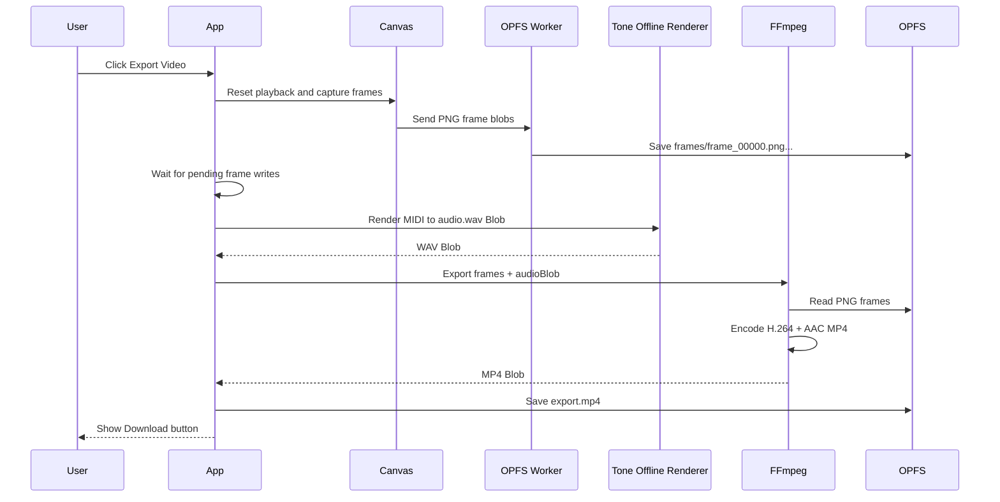

Yes — it’s possible, and the best implementation is to render the MIDI playback audio into an audio file in-browser, then mux that audio file with the captured PNG frame sequence using FFmpeg WASM.

The key is: **don’t try to capture live speakers/system audio**. Instead, generate a deterministic audio export from the same `MidiData` used by the canvas, then pass that audio blob into `FFMPEGVideoExporter`.

## Recommended approach

Use **Tone.js offline rendering** to create a WAV file from the MIDI notes, then FFmpeg muxes:

```text
PNG frames from OPFS + rendered audio.wav -> output.mp4
```

This avoids sync drift from real-time recording and keeps export duration aligned with the visual timeline.

---

## Implementation Plan

### 1. Add an audio export renderer

Create a new file, probably:

```text
src/features/audio/renderToneMidiAudio.ts
```

or:

```text
src/features/export/renderExportAudio.ts
```

Its job:

```ts
export async function renderMidiToWavBlob(
  midiData: MidiData,
  durationSeconds: number,
): Promise<Blob>;
```

Internally it should:

1. Ensure Tone.js is loaded.
2. Use `Tone.Offline(...)` to render audio without playing it through speakers.
3. Create a fresh offline sampler using the same Salamander Grand Piano sample map from `ToneAudioEngine.ts`.
4. Add the same reverb settings.
5. Schedule each MIDI note with `triggerAttackRelease`.
6. Convert the rendered `AudioBuffer`/`ToneAudioBuffer` into a WAV `Blob`.

Conceptually:

```ts
const renderedBuffer = await window.Tone.Offline(async () => {
  const reverb = new window.Tone.Reverb({
    decay: 2.2,
    wet: 0.25,
  }).toDestination();

  await reverb.generate();

  const sampler = new window.Tone.Sampler({
    urls: pianoSamples,
    baseUrl: "https://tonejs.github.io/audio/salamander/",
  }).connect(reverb);

  await window.Tone.loaded();

  for (const note of midiData.notes) {
    sampler.triggerAttackRelease(
      window.Tone.Frequency(note.midi, "midi").toNote(),
      note.duration,
      note.time,
      Math.min(Math.max(note.velocity / 127, 0.1), 1),
    );
  }
}, durationSeconds);
```

Then encode to WAV.

---

### 2. Extract shared piano sample config

Right now `ToneAudioEngine.ts` owns the piano sample map inline.

Move this into a shared module:

```text
src/features/audio/pianoSamples.ts
```

Example:

```ts
export const pianoSampleBaseUrl = "https://tonejs.github.io/audio/salamander/";

export const pianoSamples: Record<string, string> = {
  A0: "A0.mp3",
  C1: "C1.mp3",
  "D#1": "Ds1.mp3",
  // ...
  C8: "C8.mp3",
};

export const pianoReverbOptions = {
  decay: 2.2,
  wet: 0.25,
};
```

Then use it in both:

```text
src/features/audio/ToneAudioEngine.ts
src/features/audio/renderToneMidiAudio.ts
```

This prevents the live piano sound and exported piano sound from drifting apart in config.

---

### 3. Add WAV encoding utility

Create:

```text
src/utils/audio.ts
```

or keep it near the audio exporter.

Function:

```ts
export function audioBufferToWavBlob(buffer: AudioBuffer): Blob;
```

It should write a standard PCM WAV header and interleaved 16-bit samples.

Why WAV?

- Easy to generate manually.
- FFmpeg WASM can reliably read it.
- No browser codec/container weirdness.
- Great intermediate format for muxing.

For a 16-second stereo 44.1kHz export, WAV size is reasonable.

---

### 4. Extend export types

Update:

```text
src/types.ts
```

Currently the exporter likely has something like:

```ts
export interface VideoExportOptions {
  durationSeconds?: number;
}
```

Extend it:

```ts
export interface VideoExportOptions {
  durationSeconds?: number;
  audioBlob?: Blob;
}
```

Then keep this signature:

```ts
exportVideo(fileUri: string, options?: VideoExportOptions): Promise<Blob>
```

---

### 5. Update `FFMPEGVideoExporter.ts` to accept audio

In:

```text
src/features/export/FFMPEGVideoExporter.ts
```

Update `exportVideo` so that when `options.audioBlob` exists, it writes it into FFmpeg’s virtual FS:

```ts
await this.ffmpeg.writeFile("audio.wav", await fetchFile(options.audioBlob));
```

Then use a different FFmpeg command.

#### Without audio

Keep the current video-only command:

```ts
[
  "-framerate",
  computedFrameRate,
  "-i",
  "frame_%05d.png",
  "-vf",
  "scale=trunc(iw/2)*2:trunc(ih/2)*2,format=yuv420p",
  "-c:v",
  "libx264",
  "-preset",
  "ultrafast",
  "-crf",
  "23",
  "-movflags",
  "+faststart",
  "output.mp4",
];
```

#### With audio

Use:

```ts
[
  "-framerate",
  computedFrameRate,
  "-i",
  "frame_%05d.png",
  "-i",
  "audio.wav",
  "-vf",
  "scale=trunc(iw/2)*2:trunc(ih/2)*2,format=yuv420p",
  "-c:v",
  "libx264",
  "-preset",
  "ultrafast",
  "-crf",
  "23",
  "-c:a",
  "aac",
  "-b:a",
  "192k",
  "-shortest",
  "-movflags",
  "+faststart",
  "output.mp4",
];
```

Important details:

- Keep the existing **duration-aware input framerate**:

  ```ts
  frameNames.length / durationSeconds;
  ```

- Keep the even-dimension video filter.
- Use `-shortest` so an audio tail does not accidentally extend the MP4 beyond the visual track.
- Delete `audio.wav` from FFmpeg FS during cleanup.

---

### 6. Update `useExport.ts`

Change:

```ts
exportViaFFMPEGWASM(durationSeconds?: number)
```

to:

```ts
exportViaFFMPEGWASM(durationSeconds?: number, audioBlob?: Blob)
```

Then call:

```ts
const videoBlob = await exporter.exportVideo("frames", {
  durationSeconds,
  audioBlob,
});
```

Update UI messages:

```ts
setExportMessage(
  audioBlob ? "Encoding video with piano audio..." : "Encoding video...",
);
```

---

### 7. Update `App.tsx` export flow

`App.tsx` should decide whether to render audio because it owns:

- `midiData.current`
- current song duration
- export flow
- toolbar state

Add state:

```ts
const [includeAudioInExport, setIncludeAudioInExport] = useState(true);
```

Pass it to `Toolbar` as a checkbox/toggle.

When export playback finishes and pending frames are done, before calling FFmpeg:

```ts
let audioBlob: Blob | undefined;

if (includeAudioInExport && midiData.current) {
  audioBlob = await renderMidiToWavBlob(midiData.current, durationRef.current);
}

await exportViaFFMPEGWASMRef.current(durationRef.current, audioBlob);
```

The audio should be rendered **after visual frame capture** and **before FFmpeg encoding**.

Do not generate audio inside the canvas loop.

---

### 8. Update the toolbar UI

In:

```text
src/components/Toolbar.tsx
```

Add typed props:

```ts
interface ToolbarProps {
  // existing props...
  includeAudioInExport: boolean;
  onIncludeAudioInExportChange: (include: boolean) => void;
}
```

Add a small toggle near `Export Video`, maybe:

```tsx
<label>
  <input
    type="checkbox"
    checked={includeAudioInExport}
    onChange={(event) => onIncludeAudioInExportChange(event.target.checked)}
  />
  Include piano audio
</label>
```

Potential UX behavior:

- Default: enabled.
- Disable while exporting.
- Optionally show as disabled if `midiData.current` is unavailable.

---

### 9. Update export overlay messages

In:

```text
src/components/ExportOverlay.tsx
```

No major structural change is needed if it already displays `exportMessage`.

But the flow should now show stages like:

```text
Recording visual frames...
Rendering piano audio...
Encoding video with audio...
Saving compiled video...
Ready to download
```

---

## Expected export flow after implementation



---

## Main risks / things to verify

### 1. Tone Offline + remote samples

Tone offline rendering should work, but remote sample loading must complete before scheduling/export completes.

Use:

```ts
await window.Tone.loaded();
```

inside the offline render setup.

### 2. Reverb tail

If you render exactly `durationSeconds`, the reverb tail may be cut off.

Options:

- Keep exact duration for perfect video sync.
- Render `durationSeconds + 1.5`, but use FFmpeg `-shortest` or `-t durationSeconds`.
- Add an advanced option later for “include reverb tail”.

For now I’d keep the exported MP4 duration equal to the visual duration.

### 3. FFmpeg AAC support

The current `@ffmpeg/core` build should usually support AAC encoding via FFmpeg’s native AAC encoder.

If AAC fails, fallback options:

```text
-c:a mp3
```

or output `.webm`, but MP4 + AAC is the preferred target.

### 4. Memory usage

This adds another large in-memory asset:

- PNG frames in FFmpeg FS
- WAV audio file
- MP4 output blob

For short/medium songs this is fine. For long songs, export may become memory-heavy. The UI should continue to call the export experimental/browser-dependent.

---

## Suggested implementation order

1. Extract piano sample config from `ToneAudioEngine.ts`.
2. Add `renderMidiToWavBlob`.
3. Add WAV encoder utility.
4. Extend `VideoExportOptions`.
5. Update `FFMPEGVideoExporter.exportVideo` to optionally mux audio.
6. Update `useExport.exportViaFFMPEGWASM(durationSeconds, audioBlob)`.
7. Add `includeAudioInExport` state and toolbar checkbox.
8. Wire `App.tsx` to render audio after frame capture and before FFmpeg.
9. Run:

```bash
npm run lint
npm run build
```

10. Browser test:
    - Export demo song with audio enabled.
    - Confirm MP4 duration matches demo duration.
    - Confirm downloaded MP4 has audible piano.
    - Confirm export without audio still works.
