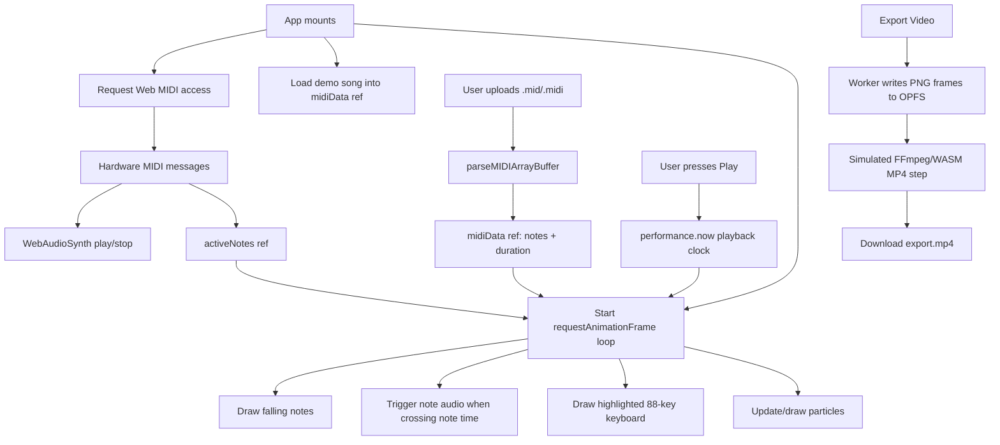

# FlowKeys 🎹

FlowKeys is a browser-based MIDI visualizer built with React, Vite, Tailwind
CSS, Canvas, Web MIDI, and Web Audio. It displays an 88-key piano with falling
note bars, live MIDI input highlighting, hand-colored notes, particle sparks,
and an experimental OPFS-backed video export flow.


## Features

- 🎹 **88-key piano visualization** from A0 (`21`) to C8 (`108`)
- 🎵 **MIDI file playback** via a built-in MIDI parser in `src/App.tsx`
- 🎛️ **Live Web MIDI input** for connected keyboards/controllers
- 🔊 **Web Audio synthesis** with lightweight oscillator voices
- 🌈 **Separate left/right hand colors** using Middle C (`60`) as the split
  point
- ✨ **Particle spark effects** with object pooling for smoother rendering
- ⏯️ **Playback controls** for play/pause, seeking, speed, mute, and upload
- 🎬 **Experimental video export** that captures PNG frames to OPFS and
  simulates MP4 encoding
- 📱 **PWA configuration** through `vite-plugin-pwa`

## Tech Stack

- **React 19 + TypeScript** for the app shell and UI state
- **Vite 7** for dev/build tooling
- **Tailwind CSS 4** through `@tailwindcss/vite`
- **Canvas 2D API** for all visualization rendering
- **Web MIDI API** for hardware MIDI input
- **Web Audio API** for synthesized playback/free-play audio
- **OPFS** (`navigator.storage.getDirectory`) and a Web Worker for export frame
  storage
- **vite-plugin-pwa** for app manifest/service-worker generation
- **Lucide React** for UI icons

> Note: `tone` and `@tonejs/midi` are currently listed in `package.json`, but
> the current `App.tsx` implementation uses its own MIDI parser and a custom
> `WebAudioSynth` class instead of Tone.js.

## Project Structure

```text
midivisualizer/
├── public/                 # Static assets referenced by the PWA manifest
├── src/
│   ├── App.tsx             # Main app, parser, synth, canvas renderer, export flow
│   ├── index.css           # Tailwind CSS import
│   └── main.tsx            # React entry point + PWA service worker registration
├── index.html              # Vite HTML entry point
├── package.json            # Scripts and dependencies
├── tsconfig*.json          # TypeScript configuration
├── vite.config.ts          # React/Tailwind/PWA Vite config
└── AGENTS.md               # Codebase guide for AI agents and maintainers
```

## Application Flow



### 1. Startup

On mount, `App`:

1. Requests Web MIDI access when available.
2. Registers MIDI input handlers for connected devices.
3. Loads a generated demo song (`Pachelbel Canon Demo`) into `midiData.current`.
4. Starts the canvas animation loop.
5. Cleans up animation frames and any export worker on unmount.

The app also shows an **Enable Audio** banner until a user gesture
initializes/resumes the Web Audio context.

### 2. MIDI Data Model

MIDI notes are normalized to this shape:

```ts
{
  midi: number; // MIDI note number, e.g. 60 for middle C
  time: number; // note start time in seconds
  duration: number; // note length in seconds
  velocity: number; // MIDI velocity, usually 0-127
  track: number; // source MIDI track index
}
```

`midiData.current` stores:

```ts
{
  notes: Note[];
  duration: number;
}
```

Refs are used for frequently updated data (`midiData`, `activeNotes`, playback
timing, worker state) so the 60fps render loop does not force unnecessary React
re-renders.

### 3. MIDI File Parsing

`parseMIDIArrayBuffer` in `src/App.tsx` parses standard MIDI file bytes
directly:

- Validates the `MThd` header.
- Reads track chunks (`MTrk`).
- Handles variable-length delta times.
- Supports running status.
- Extracts note-on/note-off pairs.
- Reads tempo meta events (`0xFF 0x51`).
- Converts ticks to seconds using tempo changes.

This parser is intentionally local and dependency-free. If you replace it with a
library parser, preserve the app’s normalized note shape or update all
consumers.

### 4. Playback Timing and Audio

Playback uses `performance.now()` instead of Tone.Transport:

- `playbackStartTime.current` stores the wall-clock start offset.
- `pausedTime.current` stores the seek/pause position.
- `currentTime` is React state for UI display and slider control.
- `lastTimeSec.current` is used to detect newly crossed notes and trigger audio
  once.

`WebAudioSynth` is a simple custom synth:

- Lazily creates/resumes `AudioContext` after a user gesture.
- Converts MIDI note numbers to Hz.
- Uses a triangle oscillator plus a sine oscillator one octave above.
- Applies a short attack and decay envelope with `GainNode` automation.
- Tracks active voices in a `Map` by MIDI note number.

### 5. Canvas Rendering

`renderCanvas` is the core animation loop. Each frame:

1. Calculates `dt` and current playback time.
2. Clears the canvas with a dark background.
3. Computes keyboard layout for the current canvas width.
4. Draws visible falling note bars.
5. Triggers playback audio for notes whose start time was crossed this frame.
6. Builds an `activeMap` from live MIDI and current playback notes.
7. Emits particles at the keyboard hit line for active playback notes.
8. Draws the red hit line.
9. Updates/draws the particle pool.
10. Draws white keys, then black keys, highlighting active notes.
11. Captures a PNG frame to OPFS if export is active.
12. Schedules the next `requestAnimationFrame`.

### 6. Keyboard Layout

The keyboard constants live near the top of `src/App.tsx`:

```ts
const FIRST_NOTE = 21; // A0
const LAST_NOTE = 108; // C8
const KEYBOARD_HEIGHT = 120;
const HAND_SPLIT_NOTE = 60; // Middle C
```

`getLayout(width)` calculates positions for all 88 notes:

- 52 white keys are evenly distributed across the canvas width.
- 36 black keys are placed relative to the previous white key.
- `isBlackKey(midi)` checks pitch class `[1, 3, 6, 8, 10]`.

### 7. Export Flow

The export feature is experimental:

1. `startExport` checks OPFS support and creates an inline Web Worker from
   `WORKER_CODE`.
2. The worker initializes/clears an OPFS `frames` directory.
3. Playback restarts from `0` while `renderCanvas` sends each captured canvas
   PNG to the worker.
4. When playback reaches the end, `mockExportViaFFMPEGWASM` reads frame names
   from OPFS.
5. The current implementation simulates encoding and writes an `export.mp4`
   placeholder/fetched mock video to OPFS.
6. `downloadVideo` downloads `export.mp4` and clears captured frames.

Because encoding is currently mocked, do not describe export as production-grade
video encoding without updating the implementation.

## Vite and PWA Configuration

`vite.config.ts` enables:

- `@vitejs/plugin-react`
- `@tailwindcss/vite`
- `vite-plugin-pwa` with `registerType: "autoUpdate"`
- A PWA manifest named **FlowKeys - Real-time MIDI Visualizer**
- Landscape-oriented standalone display metadata
- Static asset inclusion for `favicon.svg` and `og-image.svg`
- Workbox precaching for common build/static asset types
- Runtime caching for Google Fonts CSS
- `navigateFallback: null`
- PWA disabled during dev (`devOptions.enabled: false`)

`src/main.tsx` registers the generated service worker and prompts when a refresh
is available.

## Getting Started

### Prerequisites

- Node.js compatible with Vite 7
- npm
- A modern browser with Canvas and Web Audio support
- Chrome/Edge recommended for Web MIDI and OPFS support
- Optional USB MIDI keyboard/controller

### Install and Run

```bash
npm install
npm run dev
```

Open the URL printed by Vite, usually `http://localhost:5173`.

### Build and Preview

```bash
npm run build
npm run preview
```

### Lint

```bash
npm run lint
```

## Usage

### Play the Demo Song

1. Open the app.
2. Click **Enable Audio** if you want sound.
3. Press **Play**.
4. Use the speed slider, particle toggle, mute button, and timeline slider as
   needed.

### Upload a MIDI File

1. Click **Upload MIDI**.
2. Select a `.mid` or `.midi` file.
3. Press **Play**.
4. Seek with the timeline slider.

### Use Hardware MIDI

1. Connect a MIDI keyboard/controller.
2. Grant MIDI access in the browser if prompted.
3. Play notes; keys are highlighted and audio is triggered live.

### Customize Hand Colors

Use the left/right hand controls over the canvas. Notes below Middle C use the
left-hand color; notes at or above Middle C use the right-hand color.

## Browser Support Notes

- **Chrome/Edge**: Best support for Web MIDI, Web Audio, Canvas, OPFS, and PWA
  behavior.
- **Firefox/Safari**: Canvas and Web Audio work, but Web MIDI and OPFS support
  may be missing or limited.
- Audio initialization requires a user gesture due to browser autoplay policies.

## Development Notes

- Most app logic currently lives in `src/App.tsx`. See `AGENTS.md` before making
  larger changes.
- Keep render-loop data in refs unless React state is needed for UI.
- Be careful with `renderCanvas` dependencies; changing them can restart the
  animation effect.
- The MIDI parser currently supports the MIDI events needed for note
  visualization/playback, but it is not a complete general-purpose MIDI
  implementation.
- Video export is an OPFS frame-capture prototype with mocked encoding.

## License

MIT License - feel free to use this project for learning and personal projects.
