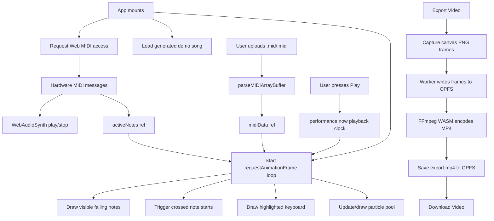

# FlowKeys 🎹

FlowKeys is a browser-based MIDI visualizer built with React, Vite, TypeScript,
Tailwind CSS, Canvas 2D, Web MIDI, Web Audio, OPFS, and FFmpeg WASM. It displays
an 88-key piano with falling note bars, live MIDI highlighting, hand-colored
notes, particle sparks, and MP4 video export.


## Features

- 🎹 **88-key piano visualization** from A0 (`21`) to C8 (`108`)
- 🎵 **MIDI file playback** with a built-in MIDI parser
- 🎛️ **Live Web MIDI input** for connected keyboards/controllers
- 🔊 **Custom Web Audio synthesis** with lightweight oscillator voices
- 🌈 **Separate left/right hand colors** using Middle C (`60`) as the split point
- ✨ **Particle spark effects** with object pooling and frame-rate independent motion
- ⏯️ **Playback controls** for play/pause, seeking, speed, mute, particles, and upload
- 🎬 **MP4 video export** using Canvas PNG frame capture, OPFS, a Web Worker, and FFmpeg WASM
- 📱 **PWA setup** through `vite-plugin-pwa`

## Tech Stack

- **React 19 + TypeScript** for the app shell and UI state
- **Vite 7** for dev/build tooling
- **Tailwind CSS 4** through `@tailwindcss/vite`
- **Canvas 2D API** for all visualization rendering
- **Web MIDI API** for hardware MIDI input
- **Web Audio API** for synthesized playback and live input audio
- **OPFS** (`navigator.storage.getDirectory`) for captured frames and exported video
- **Web Worker** for writing PNG frames without blocking the render loop
- **@ffmpeg/ffmpeg + @ffmpeg/util** for browser-side MP4 encoding
- **vite-plugin-pwa** for manifest/service-worker generation
- **Lucide React** for UI icons

## Project Structure

```text
midivisualizer/
├── public/                         Static assets referenced by the app/PWA
├── src/
│   ├── App.tsx                     Main coordinator: state, refs, MIDI wiring, render loop, export capture
│   ├── App.css                     App stylesheet if used by future UI work
│   ├── index.css                   Tailwind CSS import
│   ├── main.tsx                    React entry point + PWA service worker registration
│   ├── types.ts                    Export-related shared TypeScript interfaces
│   ├── vite-env.d.ts               Vite/PWA refs plus app/browser global type shims
│   ├── assets/
│   │   └── react.svg
│   ├── components/
│   │   ├── EnableAudioBanner.tsx   Audio autoplay prompt
│   │   ├── ErrorMessageBanner.tsx  Dismissible error banner
│   │   ├── ExportOverlay.tsx       Recording/processing/ready export modal
│   │   ├── HandBadge.tsx           Left/right color pickers + current file name
│   │   └── Toolbar.tsx             Header controls and timeline
│   ├── features/
│   │   ├── audio/
│   │   │   ├── WebAudioSynth.ts    Custom oscillator-based Web Audio synth
│   │   │   └── midi.ts             Built-in MIDI parser
│   │   ├── canvas/
│   │   │   └── Particles.tsx       Particle + ParticlePool classes
│   │   ├── export/
│   │   │   └── FFMPEGVideoExporter.ts  FFmpeg WASM loader/encoder and export config
│   │   └── layout/
│   │       └── layoutUtils.ts      Keyboard layout, colors, time formatting helpers
│   ├── hooks/
│   │   ├── useExport.ts            Export UI state, FFmpeg orchestration, OPFS download helper
│   │   └── useMidi.ts              Reserved for future MIDI hook extraction
│   └── utils/
│       ├── error.ts                Error-to-string helper
│       └── layout.ts               Piano constants
├── index.html
├── package.json
├── tsconfig*.json
├── vite.config.ts                  React/Tailwind/PWA config + FFmpeg-related dev headers
└── AGENTS.md                       Codebase guide for AI agents and maintainers
```

## Application Flow



### Startup

On mount, `App`:

1. Requests Web MIDI access when available.
2. Registers MIDI input handlers for connected devices.
3. Loads a generated demo song (`Pachelbel Canon Demo`) into `midiData.current`.
4. Starts the canvas animation loop.
5. Cleans up animation frames and any export worker on unmount.

The app shows an **Enable Audio** banner until a user gesture initializes/resumes
the Web Audio context.

### MIDI Data Model

MIDI notes are normalized to this shape:

```ts
{
  midi: number; // MIDI note number, e.g. 60 for middle C
  time: number; // note start time in seconds
  duration: number; // note length in seconds
  velocity: number; // MIDI velocity, usually 0-127
  track: number; // source MIDI track index
}
```

`midiData.current` stores:

```ts
{
  notes: MidiNote[];
  duration: number;
}
```

Parsed notes are sorted by `time` so the render loop can skip off-screen notes
and break early once future notes are beyond the visible window.

### Playback Timing and Performance

Playback uses `performance.now()` instead of an external transport scheduler.
Render-critical values are kept in refs so the animation callback remains stable
and does not restart on every UI state change.

Important refs/state include:

- `playbackStartTime.current`: wall-clock playback offset
- `pausedTime.current`: current paused/seek position
- `currentTimeRef.current`: current playback position used by the render loop
- `currentTime`: React state used only for UI display/slider updates
- `lastUIUpdateRef.current`: throttles UI time updates to roughly 10fps
- `isPlayingRef`, `fallSpeedRef`, `leftColorRef`, `rightColorRef`,
  `particlesEnabledRef`, `durationRef`: render-loop-safe mirrors of UI state
- `lastTimeSec.current`: used to trigger playback audio once when note starts are crossed

### Canvas Rendering

`renderCanvas` in `src/App.tsx` is the hot path. Each frame it:

1. Computes `dt`, clamped to avoid huge frame-drop jumps.
2. Computes current playback time from refs.
3. Updates `currentTime` React state only periodically for UI display.
4. Clears the canvas.
5. Computes keyboard layout for the current canvas width.
6. Iterates only the MIDI notes inside the visible time window.
7. Draws falling note bars.
8. Triggers synthesized audio for notes whose start time was crossed this frame.
9. Tracks active playback notes and live MIDI notes for key highlighting.
10. Emits particles at the keyboard hit line.
11. Draws the hit line, particles, white keys, then black keys.
12. Captures a PNG export frame when export capture is active and enough time has elapsed.

Coordinate model:

```ts
const hitLineY = canvas.height - KEYBOARD_HEIGHT;
const timeUntilHit = note.time - timeSec;
const yBottom = hitLineY - timeUntilHit * fallSpeed;
const noteHeight = note.duration * fallSpeed;
const yTop = yBottom - noteHeight;
```

### Audio

`src/features/audio/WebAudioSynth.ts` provides the current audio path:

- Lazily creates/resumes `AudioContext` from user gesture paths.
- Converts MIDI note numbers to frequencies.
- Uses simple oscillator/gain envelopes for lightweight playback.
- Tracks active voices by MIDI note.
- Honors the app mute toggle via `audioSynth.current.isMuted`.

### Particles

`src/features/canvas/Particles.tsx` contains an object-pooled particle system.
Particles use pixels-per-second velocity and update with `dt`, so motion is
frame-rate independent. The draw path avoids per-particle `shadowBlur` and
per-particle `save()`/`restore()` calls; the pool wraps the pass once with
additive blending.

### Export Flow

The export feature now performs real browser-side MP4 encoding with FFmpeg WASM.
It is still browser-resource-heavy and depends on OPFS and modern browser support.

1. `startExport()` checks OPFS support.
2. `App.tsx` creates an inline Web Worker from `WORKER_CODE`.
3. The worker initializes and clears an OPFS `frames` directory.
4. Playback restarts from `0` and export capture begins.
5. `renderCanvas` captures PNG frames with `canvas.toBlob` at the configured export interval.
6. The worker writes frames as `frame_00000.png`, `frame_00001.png`, etc.
7. When playback ends, `App.tsx` waits for pending frame writes to finish.
8. `useExport.exportViaFFMPEGWASM(durationSeconds)` loads/reuses FFmpeg WASM.
9. `FfmpegVideoExporter.exportVideo(...)` reads OPFS frames into FFmpeg’s virtual FS.
10. FFmpeg encodes `output.mp4` with H.264.
11. The MP4 is saved back to OPFS as `export.mp4`.
12. The overlay shows **Download Video**, and `downloadVideoFromOPFS` downloads the MP4 and clears frames.

Important export details:

- `exportConfig` in `src/features/export/FFMPEGVideoExporter.ts` defines the nominal FPS, frame interval, directory, file name, and extension.
- Canvas frame capture can miss the nominal FPS because `canvas.toBlob` and OPFS writes are async.
- To keep the exported duration aligned with the source song, FFmpeg’s input `-framerate` is computed from:

  ```text
  captured frame count / source duration seconds
  ```

- The FFmpeg filter chain forces even H.264 dimensions and yuv420p output:

  ```text
  scale=trunc(iw/2)*2:trunc(ih/2)*2,format=yuv420p
  ```

- `vite.config.ts` sets COOP/COEP dev headers and excludes FFmpeg packages from Vite dependency pre-bundling.
- The PWA Workbox config caches FFmpeg core files from jsDelivr for faster subsequent loads.

## Vite and PWA Configuration

`vite.config.ts` enables:

- `@vitejs/plugin-react`
- `@tailwindcss/vite`
- `vite-plugin-pwa` with `registerType: "autoUpdate"`
- App manifest metadata for FlowKeys
- Workbox precaching for common build/static assets
- Runtime caching for Google Fonts CSS
- Runtime caching for `@ffmpeg/core` ESM assets from jsDelivr
- `navigateFallback: null`
- Dev `Cross-Origin-Opener-Policy` / `Cross-Origin-Embedder-Policy` headers for FFmpeg/WASM compatibility
- `optimizeDeps.exclude` for `@ffmpeg/ffmpeg` and `@ffmpeg/util`

`src/main.tsx` registers the generated service worker and prompts when a refresh
is available.

## Getting Started

### Prerequisites

- Node.js compatible with Vite 7
- npm
- A modern browser with Canvas and Web Audio support
- Chrome/Edge recommended for Web MIDI, OPFS, and FFmpeg WASM export
- Optional USB MIDI keyboard/controller

### Install and Run

```bash
npm install
npm run dev
```

Open the URL printed by Vite, usually `http://localhost:5173`.

### Build and Preview

```bash
npm run build
npm run preview
```

### Lint

```bash
npm run lint
```

## Usage

### Play the Demo Song

1. Open the app.
2. Click **Enable Audio** if you want sound.
3. Press **Play**.
4. Use the speed slider, particle toggle, mute button, and timeline slider as needed.

### Upload a MIDI File

1. Click **Upload MIDI**.
2. Select a `.mid` or `.midi` file.
3. Press **Play**.
4. Seek with the timeline slider.

### Use Hardware MIDI

1. Connect a MIDI keyboard/controller.
2. Grant MIDI access in the browser if prompted.
3. Play notes; keys are highlighted and audio is triggered live.

### Customize Hand Colors

Use the left/right hand controls over the canvas. Notes below Middle C use the
left-hand color; notes at or above Middle C use the right-hand color.

### Export Video

1. Click **Export Video**.
2. Wait while the app captures frames and FFmpeg WASM encodes the MP4.
3. Click **Download Video** when the overlay says export is complete.

First export may take longer because the browser downloads and initializes the
FFmpeg core. Later exports may be faster due to service worker/runtime caching.

## Browser Support Notes

- **Chrome/Edge**: Best support for Web MIDI, Web Audio, Canvas, OPFS, PWA behavior, and FFmpeg WASM export.
- **Firefox/Safari**: Canvas and Web Audio work, but Web MIDI, OPFS, and export support may be missing or limited.
- Audio initialization requires a user gesture due to browser autoplay policies.
- FFmpeg WASM export is CPU/RAM intensive and can be slow for long songs or large canvases.

## Development Notes

- `App.tsx` still owns orchestration and the canvas render loop. See `AGENTS.md` before making larger changes.
- Keep render-loop data in refs unless React state is needed for UI.
- Be careful with `renderCanvas` dependencies; it is intentionally stable and scheduled by a surrounding effect.
- The MIDI parser supports the events needed for note visualization/playback, but it is not a complete general-purpose MIDI implementation.
- Export is real FFmpeg WASM MP4 encoding, but it remains experimental because it depends on browser OPFS/WASM performance.

## License

MIT License - feel free to use this project for learning and personal projects.
